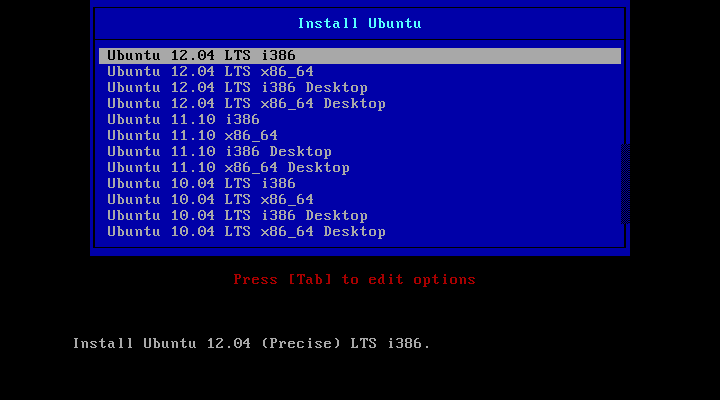
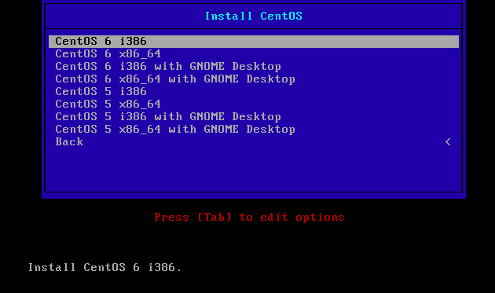
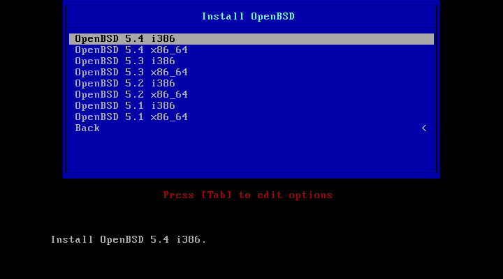

***
This document is now obsolete, provided here for reference purposes only
***

# Introduction

How to install Kippo on different operating systems. Three different methods to bind to privileged ssh port (22) were tried out: firewall redirect, authbind and capabilities.

## Raspbian

**Update** (as root)

```sh
apt-get update
apt-get upgrade
```

### Step 1: Changing the SSH port (as root)

```sh
sudo -s
cd /etc/ssh
cp sshd_config sshd_config.orig
nano sshd_config
diff sshd_config.orig sshd_config
5c5
< Port 22
---
> Port 7799
service ssh reload
```

### Step 2: Installing Dependencies (as root)

```sh
apt-get install python-dev openssl python-openssl python-pyasn1 python-twisted
apt-get install curl
```

### Step 3: Creating the Kippo User (as root)

```sh
useradd -m kippo
```

### Step 4: Allow Kippo to bind privileged port 22 (as root)

```sh
apt-get install authbind
touch /etc/authbind/byport/22
chown kippo /etc/authbind/byport/22
chmod 777 /etc/authbind/byport/22
su - kippo
```

### Step 5: Downloading and Configuring Kippo (as kippo)

```sh
curl -o kippo.tar.gz -L https://github.com/micheloosterhof/kippo/tarball/master
tar zxvf kippo.tar.gz
mv micheloosterhof-kippo-636b31c/ kippo
cd kippo
cp kippo.cfg.dist kippo.cfg
nano kippo.cfg
diff kippo.cfg.dist kippo.cfg
15c15
< ssh_port = 2222
---
> ssh_port = 22
```

## Ubuntu

**Recommended specs**

  * RAM 1gb
  * Disk 8gb

**Install**

  * install: http://boot.foo.sh/ (ISO image)
  * boot: boot.foo.sh
  * install: Ubuntu 12.04 LTS i386



**Update** (as root)

```sh
# apt-get update
# apt-get upgrade
```

### Step 1: Changing the SSH port (as root)

```sh
cd /etc/ssh
cp sshd_config sshd_config.orig
nano sshd_config
diff sshd_config.orig sshd_config
5c5
< Port 22
---
> Port 7799
reload ssh
```

### Step 2: Installing Dependencies (as root)

```sh
apt-get install python-dev openssl python-openssl python-pyasn1 python-twisted
apt-get install curl
```

### Step 3: Creating the Kippo User (as root)

```sh
useradd -m kippo
```

### Step 4: Allow Kippo to bind to privileged port 22 (as root)

```sh
apt-get install authbind
touch /etc/authbind/byport/22
chown kippo /etc/authbind/byport/22
chmod 777 /etc/authbind/byport/22
su - kippo
```

### Step 5: Downloading and Configuring Kippo (as kippo)

```sh
curl -o kippo.tar.gz -L https://github.com/micheloosterhof/kippo/tarball/master
tar zxvf kippo.tar.gz
mv micheloosterhof-kippo-636b31c/ kippo
cd kippo
cp kippo.cfg.dist kippo.cfg
nano kippo.cfg
diff kippo.cfg.dist kippo.cfg
15c15
< ssh_port = 2222
---
> ssh_port = 22
```

### Step 6: Startup Script (as kippo)

```sh
cp start.sh start.sh.orig
nano start.sh
diff start.sh.orig start.sh
4c4
< twistd -y kippo.tac -l log/kippo.log --pidfile kippo.pid
---
> authbind --deep twistd -y kippo.tac -l log/kippo.log --pidfile kippo.pid

./start.sh			# or go to Step 8 below for autostart setup
```

### Step 7: Autostart (as root)

```sh
nano /etc/init/kippo.conf
cat /etc/init/kippo.conf

start on started networking
respawn
script
  ulimit -Sn 4096
  exec start-stop-daemon -S -c kippo -d /home/kippo/kippo -x /usr/bin/authbind -- --deep twistd -n -y kippo.tac -l log/kippo.log --pidfile kippo.pid
end script

initctl reload-configuration
initctl start kippo
initctl status kippo
```

**Installation size**

```
Filesystem      Size  Used Avail Use% Mounted on
/dev/sda3       6.3G  1.2G  4.8G  19% /
udev            494M  4.0K  494M   1% /dev
```

**Free OS memory after reboot**

```
total       used       free     shared    buffers  cached Mem:   1025236      76060     949176      0        14944   32416
-/+ buffers/cache:  28700     996536
Swap:  1582076        0       1582076
```

## CentOS

**Recommended specs**
  * RAM 1gb
  * Disk 8gb

**Install**
  * install: http://boot.foo.sh/ (ISO image)
  * boot: boot.foo.sh
  * install: CentOS 6 i386



**Update** (as root)

```sh
yum update
```

### Step 1: Install python-twisted (as root)

```sh
yum install python-twisted
```

### Step 2: Move sshd to non-standard port and configure firewall (as root)

```sh
cd /etc/sysconfig
cp iptables iptables.orig
nano iptables
diff iptables.orig iptables
10a11
> -A INPUT -m state --state NEW -m tcp -p tcp --dport 7799 -j ACCEPT

service iptables restart
cd /etc/ssh
cp sshd_config sshd_config.orig
nano sshd_config
diff sshd_config.orig sshd_config
13c13
< #Port 22
---
> Port 7799

service sshd restart
```

### Step 3: Allow Python to bind to port below 1024 and add kippo user (as root)

```sh
setcap 'cap_net_bind_service=+ep' /usr/bin/python
useradd kippo
su - kippo
```

### Step 4: Install Kippo (as kippo)

```sh
curl -o kippo.tar.gz -L https://github.com/micheloosterhof/kippo/tarball/master
tar zxvf kippo.tar.gz
mv micheloosterhof-kippo-c89face/ kippo
cd kippo
cp kippo.cfg.dist kippo.cfg
diff kippo.cfg.dist kippo.cfg
15c15
< ssh_port = 2222
---
> ssh_port = 22
21c21
< hostname = nas3
---
> hostname = intra
```

### Step 5: Starting kippo (as kippo)

```sh
sh start.sh
```
**Installation size**

```
Filesystem      Size  Used Avail Use% Mounted on
/dev/sda3       6.2G  1.1G  4.8G  18% /
```

**Free OS memory after reboot**

```
total     used       free     shared    buffers     cached
Mem:   1030584    111376     919208    0         8876        45144
-/+ buffers/cache: 57356     973228
Swap:  1658872      0        1658872
```

## OpenBSD

**Recommended specs**
  * RAM 1gb
  * Disk 8gb

**Install**
  * install: http://boot.foo.sh/ (ISO image)
  * boot: boot.foo.sh
  * install: OpenBSD 5.4 i386



**Update** (as root)

```sh
pkg_add -Uu
build-system src && build-system kernel && reboot
build-system system && reboot
rm -rf /usr/src/* /usr/obj/*
```

### Step 1: Install python-twisted (as root)

```sh
/* OBSOLETE WAY: export PKG_PATH=http://ftp.eu.openbsd.org/pub/OpenBSD/`uname -r`/packages/`uname -m` */
echo "installpath = http://ftp.eu.openbsd.org/pub/OpenBSD/`uname -r`/packages/`uname -m`" > /etc/pkg.conf
pkg_add -iv py-twisted-core
pkg_add -iv py-twisted-conch
pkg_add -iv py-asn1
pkg_add -iv py-twisted-web
```

### Step 2: Configure firewall (as root)

```sh
cd /etc/
cp pf.conf pf.conf.orig
vi pf.conf
diff pf.conf.orig pf.config
9a10,12
> pass in quick proto tcp from any to self port 22 rdr-to localhost port 2222
> pass in quick proto tcp from any to self port 7799 rdr-to localhost port 22
>
10a14
> pass in quick proto tcp to port 7799

pfctl -n -f /etc/pf.conf
pfctl -f /etc/pf.conf
```

### Step 3: Add kippo user (as root)

```sh
useradd -m kippo
su - kippo
```

### Step 4: Install kippo (as kippo)

```sh
curl -o kippo.tar.gz -L https://github.com/micheloosterhof/kippo/tarball/master
tar zxvf kippo.tar.gz
mv micheloosterhof-kippo-c89face/ kippo
cd kippo
cp kippo.cfg.dist kippo.cfg
```

### Step 5: Autostart (as root)

```sh
cd /etc
cp rc.local rc.local.orig
nano rc.local
diff rc.local.orig rc.local
6a7
> su - kippo -c “cd /home/kippo/kippo ; ./start.sh“
```

**Installation size**

```
Filesystem     Size    Used   Avail Capacity  Mounted on
/dev/wd0a      6.3G    792M    5.2G    13%    /
```

**Free OS memory after reboot**

```
Memory: Real: 10M/42M act/tot Free: 955M Cache: 18M Swap: 0K/1639M
```

## Virustotal check for all (as kippo)

```sh
curl -L -o virustotalcheck 'https://docs.google.com/uc?authuser=0&id=0B2yo6ihQHh1sRlBVaFFPdUUwTDg&export=download'
chmod a+x virtustotalcheck
curl -L -o virustotalcheck-all 'https://docs.google.com/uc?authuser=0&id=0B2yo6ihQHh1sOVhtMnpMRklrMnM&export=download'
chmod a+x virustotalcheck-all
```

**virustotalcheck sample output (build-in delay due to virustotal ToS)**

```
1ad826066e9a74b7a703c2bb25c9ba320de7fde61a22b3b32f516014b5083db1
kippo/dl/20140304063301_http___122_224_34_75_8182_xfsdxd

SHA256:         1ad826066e9a74b7a703c2bb25c9ba320de7fde61a22b3b32f516014b5083db1
File name:         xfsdxd
Detection ratio:   6 / 47
Analysis date:     2014-02-26 14:55:21 UTC ( 5 days, 22 hours ago )

Antivirus             Found                      Update
DrWeb                 Linux.DDoS.9               20140226
GData                 Win32.Trojan.Agent.URNB00  20140226
Ikarus                ELF.Agent                  20140226
Microsoft             DoS:Linux/Elknot.C         20140226
TrendMicro-HouseCall  TROJ_GEN.F47V0208          20140226

URL: https://www.virustotal.com/latest-scan/1ad826066e9a74b7a703c2bb25c9ba320de7fde61a22b3b32f516014b5083db1
```

**virustotalcheck-all sample output**

```
kippo filename;sha256;virtustotal filename;detection ratio;analysis date
20140304063301_http___122_224_34_75_8182_xfsdxd;1ad826066e9a74b7a703c2bb25
c9ba320de7fde61a22b3b32f516014b5083db1;xfsdxd;6 /
47;2014-02-26 14:55:21 UTC ( 5 days, 22 hours ago )
…
```

## Patching Kippo with syslog support (as kippo)

```sh
cd /home/kippo/kippo/kippo/dblog
curl -O http://shell.jkry.org/~ecode/kippo/syslog.py
cd ..
cd ..
nano kippo.cfg
diff kippo.cfg.dist kippo.cfg
182a183
> [database_syslog]

reboot # root
```

**Testing logging and log formats** (as kippo)

```sh
tail -f /home/kippo/kippo/kippo.log
tail -f /var/log/syslog
```

Tests & resulting logs:

 1. `ssh cyberdefense@192.168.56.101`
  * [Unsuccessful ssh login (in) (kippo.log)](kippo-log-unsuccessful-ssh-login.txt)
  * [Unsuccessful ssh login (in) (syslog)](syslog-unsuccessful-ssh-login.txt)
 1. `ssh root@192.168.56.101` and run `ifconfig`
  * [Successful ssh login (in) (kippo.log)](kippo-log-successful-ssh-login.txt)
  * [Successful ssh login (in) (syslog)](syslog-successful-ssh-login.txt)
 1. `sftp root@192.168.56.101 downloads/tulokset.csv`
  * [Successful sftp (in) (kippo.log)](kippo-log-successful-sftp.txt)
  * [Successful sftp (in) (syslog)](syslog-successful-sftp.txt)
 1. `root@192.168.56.101 ifconfig`
  * [Successful ssh exec (in) (kippo.log)](kippo-log-successful-ssh-exec.txt)
  * [Successful ssh exec (in) (syslog)](syslog-successful-ssh-exec.txt)
 1. `ssh root@192.168.56.101` and run `wget http://shell.jkry.org/~ecode/kippo/syslog.py`
   * [Successful wget (out) (kippo.log)](kippo-log-successful-wget.txt)
   * [Successful wget (out) (syslog)](syslog-successful-wget.txt)

***
This document is now obsolete, provided here for reference purposes only
***
